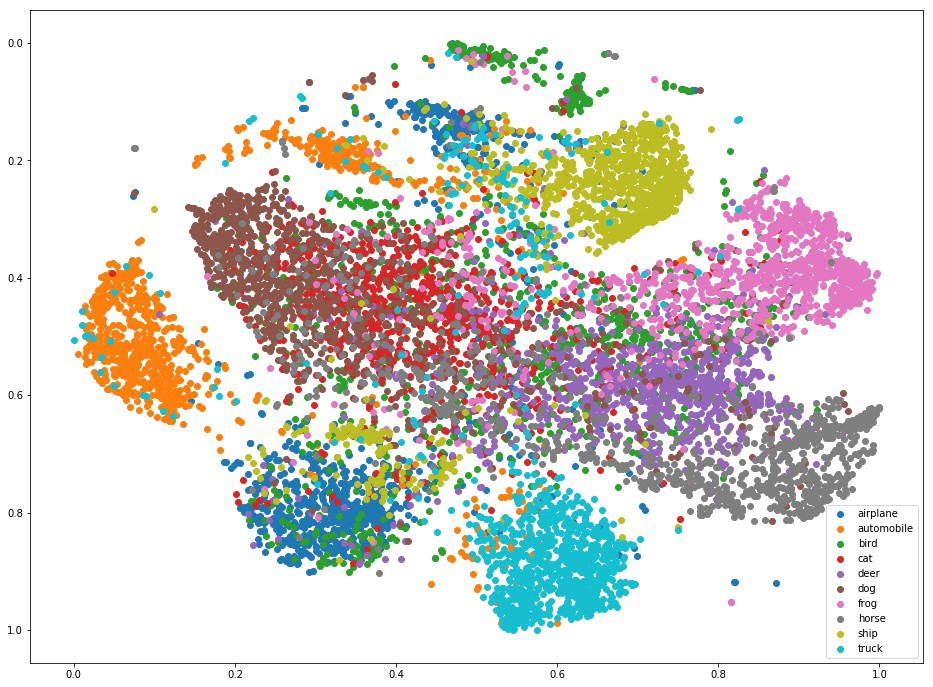
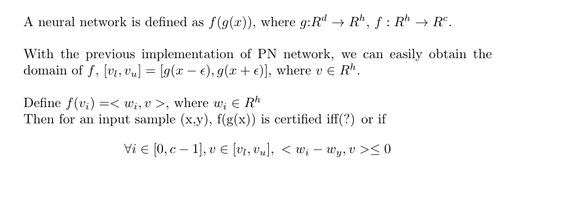

# Interval-bound-propagation-pytorch
This repository contains the pytorch attempts to replicate the results from the recent DeepMind Paper, "On the Effectiveness of Interval Bound Propagation for Training Verifiably Robust Models",https://arxiv.org/pdf/1810.12715.pdf  

## Disclaimer:
This is not an official implementation. The difference in the numbers might be due to various reasons. Please refer to the original repo, https://github.com/deepmind/interval-bound-propagation, for exact implementation details.
  
## Environments:  
Python 3.5  
Pytorch  
GTX 1080 Ti  ( The results shown on the paper was run on 32 TPU with way larger batch size. So drop in performance should be expected.)

## MNIST Results(eps = 0.1)  
| Model | Robust Acc | Nominal Acc |  
| --- | --- | --- |  
| Small | 0.96 | 0.9823 |  
| Medium | 0.9418 |0.977 |  
| Large | 0.9458 |0.9754 |  

## CIFAR Results(eps = 2/255)  
| Model | Robust Acc | Nominal Acc |  
| --- | --- | --- |  
| Small | 0.3481 | 0.5535 |  
| Medium | 0.3179 | 0.4914 |  
| Large | 0.3426 | 0.5223 |  

## T-SNE Visualization
### Robust Training

### Normal Training

### Observations
It's clear that the objective proposed is harder and it's not separable after transformations by convolutional layers.

## Derivative works
Attempting to achieve similar performance with, I speculate that we might need a "tighter" objective than the one proposed.  
On the side, I also tried a "tighter" version of IBP by constraining the weights of some layers to be non-negative and ues convex polygon in the last layer.  
  
Also sometimes Spectral Normalization seems to be able to stablize the robust training by regulating the lipschitz constant.

